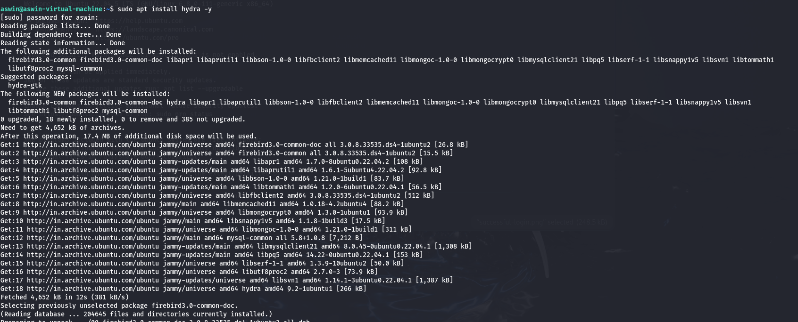
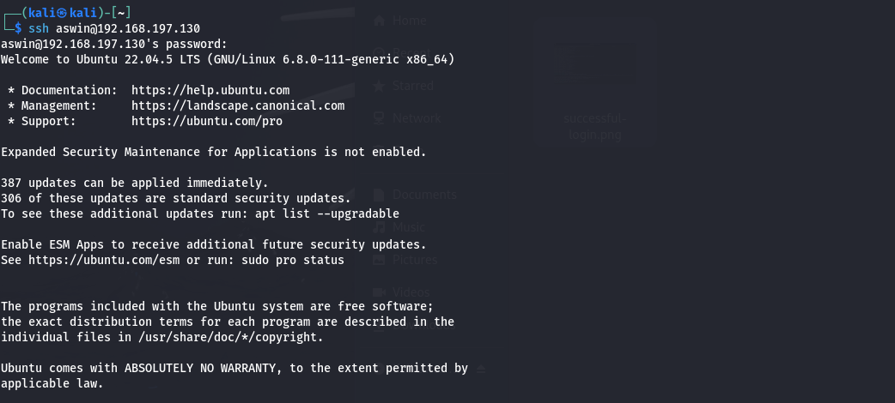
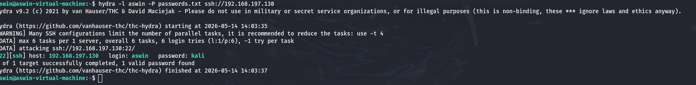
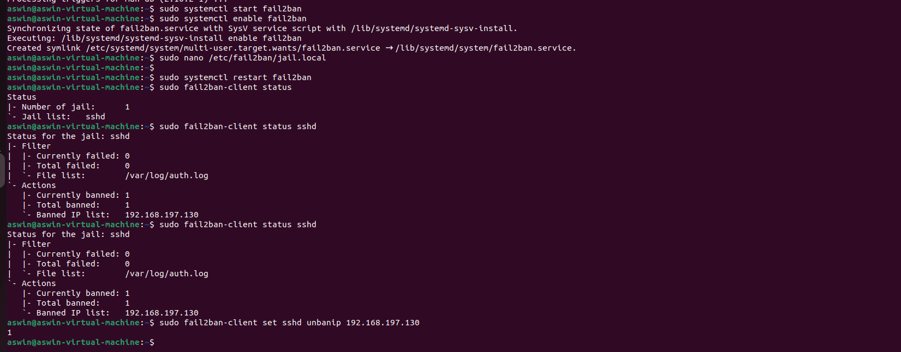
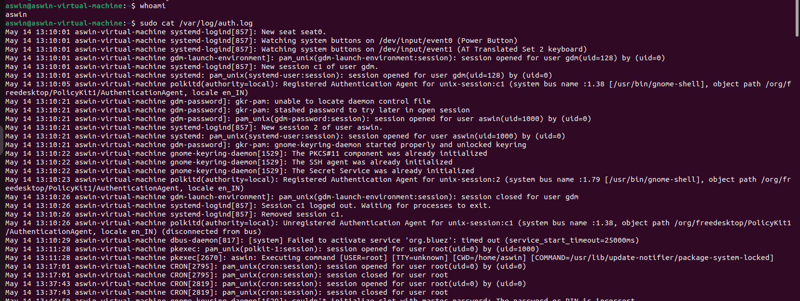

# Brute Force Attack Detection & Prevention

## Project Overview

This project demonstrates SSH brute force attack simulation using Hydra and prevention using Fail2Ban in a controlled lab environment.

---

## Tools Used

- Kali Linux
- Ubuntu Server
- Hydra
- Fail2Ban
- OpenSSH

---

## Attack Command

```bash
hydra -l aswin -P passwords.txt ssh://192.168.197.130
```

---

## Detection

Attack logs were monitored using:

```bash
/var/log/auth.log
```

---

## Prevention

Fail2Ban was configured to:
- Detect failed SSH login attempts
- Automatically ban attacker IP
- Protect SSH service

---

# Screenshots

## Hydra Installation



---

## SSH Login Success



---

## Successful Brute Force Attack



---

## Fail2Ban Configuration and Blocking



---

## SSH Setup and OpenSSH Installation


---

## Auth Logs Monitoring



---

## Disclaimer

This project was performed in a controlled lab environment for educational purposes only.
